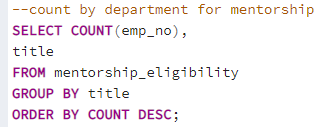
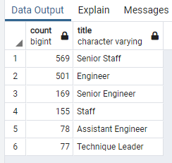
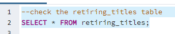
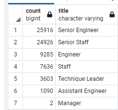

# Pewlett-Hackard-Analysis

module 7 - Introduction to SQL

## Overview of the analysis
  
The purpose of this project is to create a summary report and count of a company’s employees entering retirement age within the coming years. By manipulating CSV data imported into SQL tables to quickly get some initial estimates and counts of potential retirees by department that are due for retirement.

## Results

- There are over 70,000 (72,458) employees due to retire in the next couple of years
- Over of those 50,000 (50,842) employees are of job titles with “Senior” meaning 70% of the staff that is leaving are senior members of the company (Senior Engineers [25,916], Senior Staff [24,926]).
- Slightly over 18,000 (18,011) employees are retiring from entry to mid-level seniority, roughly 25% of the employees due retire (Engineer, Staff, Assistant Engineers)
- Just over 3,600 (3,605) employees retiring from leadership and managerial positions or roughly 5%. Two Department Managers are also scheduled to retire. (Technique Leaders [3,603], Managers [2])

## Summary

-	Over 70,000 (72,458) roles will need to be filled in the coming years to fill current positions.
-	There are not nearly enough qualified employees to mentor all the new positions needed, there are 1,549 employees qualified to be potential mentors. That would mean each mentor would need to oversee the training of 45-46 employees per mentor.

This can be seen using the following querries:

Mentors by Department

Retirees by Department

